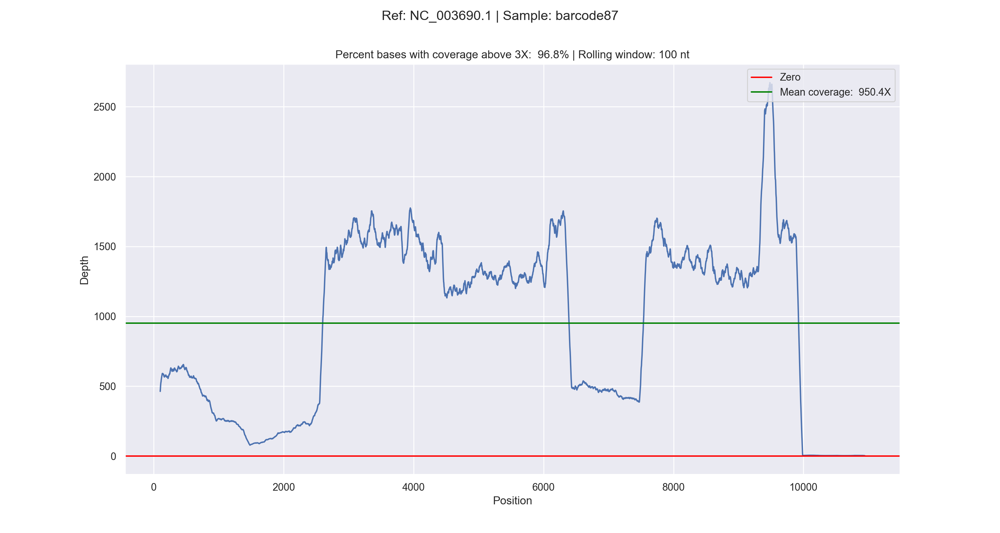

# BAM2Plot Package Documentation

The BAM2Plot package provides a comprehensive toolset for processing and visualizing coverage data from BAM files. This package simplifies the analysis process and enables the generation of coverage plots for multiple reference sequences within a single BAM file.



# Caution!
Right now bam2plot does everthing in memory, so be careful when dealing with **LARGE** files!


## Dependencies
`bam2plot` depends on `perbase`, which you can install via:
```bash
cargo install perbase 
# or
conda install -c bioconda perbase
```
## Installation

You can install BAM2Plot using the following pip command:

```bash
pip install bam2plot
```

## Usage

Once installed, you can use the `bam2plot` command to perform coverage analysis on BAM files and generate coverage plots. Here's how to use it:

```bash
bam2plot --bam <path_to_bam_file> [--sample_name <sample_name>] [--outpath <output_path>] [--rolling_window <window_size>] [--threshold <coverage_threshold>]
```

Replace the placeholders with the following information:
- `<path_to_bam_file>`: Path to the input BAM file (required).
- `<outpath>`: Path to save the output plots (optional, default: `<bam2plot>`).
- `<window_size>`: Rolling window size for calculating the depth average (optional, default: 100).
- `<coverage_threshold>`: Coverage threshold for plotting (optional, default: 3).

## Outputs

The BAM2Plot package generates coverage plots for each reference sequence in the BAM file. The plots are saved as SVG and PNG files in the specified output path or the default location.

## API Documentation

The BAM2Plot package provides several modules and functions for performing coverage analysis. Here's an overview of the main components:

### `bam2plot.sorting`

This module handles sorting BAM files using the `pysam` library.

### `bam2plot.mpileup`

This module performs the `pysam.mpileup` operation and processes the output.

### `bam2plot.analysis`

This module creates a Pandas DataFrame from the `mpileup` output and calculates the rolling average depth.

### `bam2plot.plotting`

This module generates coverage plots using `seaborn` and `matplotlib` libraries.


## Examples

Here's an example of how to use the BAM2Plot package:

```bash
bam2plot --bam input.bam --sample_name my_sample --outpath output_folder --rolling_window 50 --threshold 5
```
