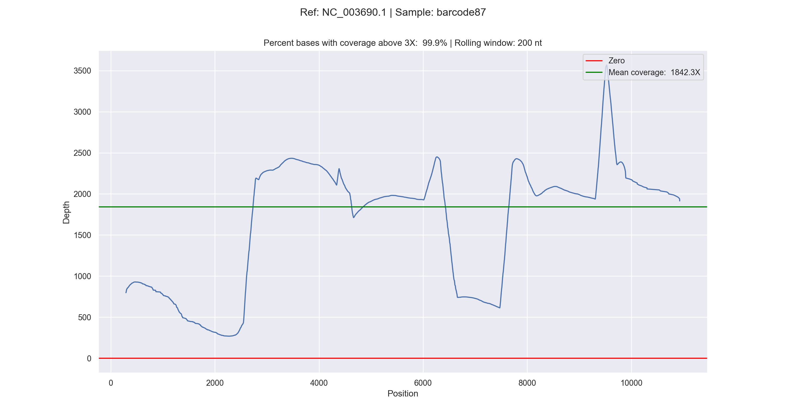
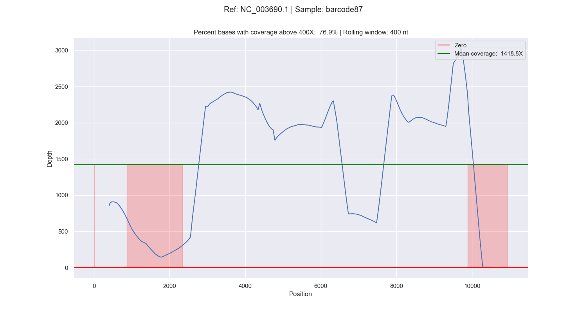
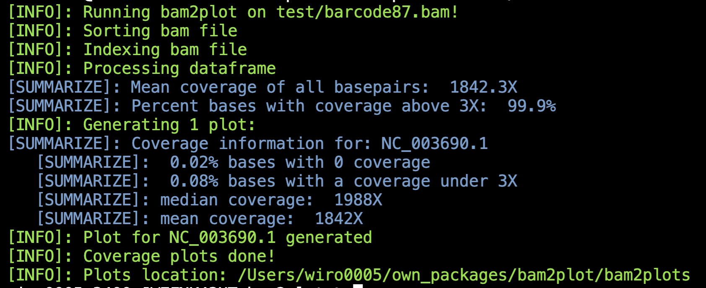

# BAM2PLOT

Plot your bam files!

## UPDATE
`bam2plot` no longer depends on `perbase`. Now, `bam2plot` depends on [mosdepth](https://github.com/brentp/mosdepth)

## Subcommands
```bash
You must call bam2plot with the following subcommands:
   [1]: 'from_bam'
   [2]: 'from_reads'
   [3]: 'guci'
```

### bam2plot from_bam
```bash
usage: bam2plot [-h] -b BAM -o OUTPATH [-w WHITELIST] [-t THRESHOLD] [-r ROLLING_WINDOW]
                [-i | --index | --no-index] [-s | --sort_and_index | --no-sort_and_index]
                [-z ZOOM] [-c | --cum_plot | --no-cum_plot] [-p {png,svg,both}]
                [-n NUMBER_OF_REFS]
                sub_command

Plot your bam files!

positional arguments:
  sub_command

options:
  -h, --help            show this help message and exit
  -b BAM, --bam BAM     bam file
  -o OUTPATH, --outpath OUTPATH
                        Where to save the plots.
  -w WHITELIST, --whitelist WHITELIST
                        Only include these references/chromosomes.
  -t THRESHOLD, --threshold THRESHOLD
                        Threshold of mean coverage depth
  -r ROLLING_WINDOW, --rolling_window ROLLING_WINDOW
                        Rolling window size
  -i, --index, --no-index
                        Index bam file
  -s, --sort_and_index, --no-sort_and_index
                        Index and sort bam file
  -z ZOOM, --zoom ZOOM  Zoom into this region. Example: -z='100 2000'
  -c, --cum_plot, --no-cum_plot
                        Generate cumulative plots of all chromosomes
  -p {png,svg,both}, --plot_type {png,svg,both}
                        How to save the plots
  -n NUMBER_OF_REFS, --number_of_refs NUMBER_OF_REFS
                        How many references (chromosomes) to plot
```

bam2plot from_bam generates coverage plots:


... and if `-c` is added, cumulative coverage plots for each reference (*e.g.* chromosomes) for each sample:


If the flag `--highlight` is given, the regions with a coverage below the `--treshold` are highlighted:


Below is an example of how bam2plot looks when runned in the terminal:


#### Examples

Here's an example of how to use the bam2plot from_bam:

```bash
bam2plot from_bam --bam input.bam --outpath output_folder --rolling_window 50 --threshold 5 -s -c
```

### bam2plot from_reads

```bash
usage: bam2plot [-h] -r1 READ_1 [-r2 READ_2] -ref REFERENCE [-gc | --guci | --no-guci] -o OUT_FOLDER
                [-r ROLLING_WINDOW] [-p {png,svg,both}]
                sub_command

Align your reads and plot the coverage!

positional arguments:
  sub_command

options:
  -h, --help            show this help message and exit
  -r1 READ_1, --read_1 READ_1
                        Fastq file 1
  -r2 READ_2, --read_2 READ_2
                        Fastq file 2
  -ref REFERENCE, --reference REFERENCE
                        Reference fasta
  -gc, --guci, --no-guci
                        Plot GC content? (default: False)
  -o OUT_FOLDER, --out_folder OUT_FOLDER
                        Where to save the plots.
  -r ROLLING_WINDOW, --rolling_window ROLLING_WINDOW
                        Rolling window size
  -p {png,svg,both}, --plot_type {png,svg,both}
                        How to save the plots
```

### bam2plot guci

```bash
usage: bam2plot [-h] -ref REFERENCE -w WINDOW -o OUT_FOLDER [-p {png,svg,both}] sub_command

Plot GC content of your reference fasta!

positional arguments:
  sub_command

options:
  -h, --help            show this help message and exit
  -ref REFERENCE, --reference REFERENCE
                        Reference fasta
  -w WINDOW, --window WINDOW
                        Rolling window size
  -o OUT_FOLDER, --out_folder OUT_FOLDER
                        Where to save the plots.
  -p {png,svg,both}, --plot_type {png,svg,both}
                        How to save the plots
```


## Dependencies
`bam2plot` depends on [mosdepth](https://github.com/brentp/mosdepth), which you can install via:
```bash
conda install -c bioconda mosdepth
```
## Installation

You can install `bam2plot` using the following pip command:

```bash
pip install bam2plot
```