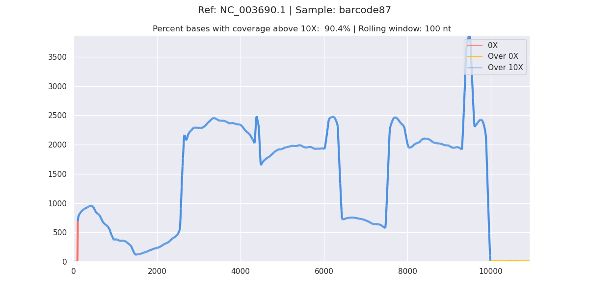
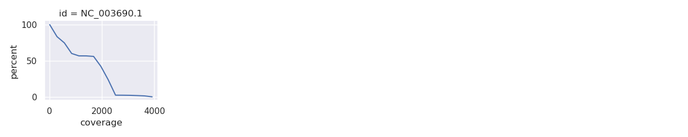
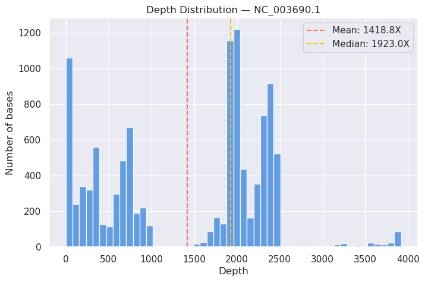
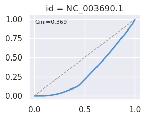

# bam2plot

Generate coverage plots and QC reports from BAM files. No external tools required.

[](https://zenodo.org/records/15052225)

## Features

- **Coverage plots** with three-color depth visualization (red = 0X, yellow = below threshold, blue = above threshold)
- **Cumulative coverage** plots per reference
- **Depth distribution histograms** (per-reference and global) with mean/median annotations
- **Coverage uniformity analysis** via Lorenz curves with Gini coefficient
- **Insert size distribution** for paired-end data with summary statistics
- **Standalone HTML report** combining all plots, statistics tables, and interactive sections into a single file
- **Median coverage** and **Gini coefficient** reported alongside mean coverage for each reference
- Direct read alignment via minimap2 (no BAM needed)
- GC content visualization for reference sequences

## Installation

```bash
pip install bam2plot
```

Python >= 3.10 required. All dependencies (pysam, polars, matplotlib, etc.) are installed automatically.

## Quick start

```bash
# Plot coverage from a BAM file (sort + index automatically)
bam2plot from_bam -b input.bam -o output_folder -s

# With cumulative coverage plots and custom threshold
bam2plot from_bam -b input.bam -o output_folder -s -c -t 20

# Plot coverage directly from reads (no BAM needed)
bam2plot from_reads -r1 reads.fastq -ref reference.fasta -o output_folder

# Plot GC content of a reference
bam2plot guci -ref reference.fasta -w 1000 -o output_folder
```

## Output

Running `from_bam` produces all of the following automatically:

### Coverage plot

Three-color depth visualization (red = 0X, yellow = below threshold, blue = above threshold):



### Cumulative coverage

Per-reference cumulative coverage plots (with `-c`):



### Depth distribution histograms

Weighted histograms showing the distribution of coverage depth across bases, with vertical lines for mean and median coverage. Generated per-reference and as a global aggregate.



### Coverage uniformity (Lorenz curves)

Lorenz curves visualize how evenly coverage is distributed across the genome. A perfectly uniform coverage would follow the diagonal; deviation below indicates uneven coverage. Each subplot is annotated with the Gini coefficient (0 = perfectly uniform, 1 = maximally unequal).



### Insert size distribution

For paired-end BAM files, a histogram of insert sizes is generated with mean, median, and standard deviation annotations. A summary statistics table is included in the HTML report.

### HTML report

A self-contained HTML report (`<sample>_report.html`) is always generated, embedding all plots as base64 images. It includes:

- **Global summary** — mean coverage, median coverage, percent bases above 0X and threshold
- **Per-reference statistics table** — total bases, mean/median coverage, percent above thresholds, Gini coefficient
- **All plots** — coverage, cumulative, depth histograms, Lorenz curves, and insert size distribution

See [example/report.html](example/report.html) for a complete example report.

## Subcommands

### `from_bam` -- BAM to coverage plot

```
bam2plot from_bam -b BAM -o OUTPATH [options]

  -b, --bam              BAM file (required)
  -o, --outpath          Output directory (required)
  -s, --sort_and_index   Sort and index the BAM before plotting
  -i, --index            Index only (BAM must already be sorted)
  -t, --threshold        Coverage depth threshold (default: 10)
  -r, --rolling_window   Rolling window size for smoothing (default: 100)
  -n, --number_of_refs   How many references to plot (default: 10, max: 100)
  -w, --whitelist        Only plot these references
  -z, --zoom             Zoom into a region, e.g. -z='1000 5000'
  -c, --cum_plot         Also generate cumulative coverage plots
  -p, --plot_type        Output format: png, svg, or both (default: png)
```

### `from_reads` -- Reads + reference to coverage plot

Aligns reads to a reference using minimap2 (via mappy) and plots coverage. Supports both long reads and paired-end short reads.

```
bam2plot from_reads -r1 READ_1 -ref REFERENCE -o OUT_FOLDER [options]

  -r1, --read_1          FASTQ file (required)
  -r2, --read_2          Second FASTQ for paired-end reads
  -ref, --reference      Reference FASTA (required)
  -o, --out_folder       Output directory (required)
  -gc, --guci            Overlay GC content on the coverage plot
  -r, --rolling_window   Rolling window size (default: 50)
  -p, --plot_type        Output format: png, svg, or both (default: png)
```

### `guci` -- GC content plot

Computes per-base GC content of a reference FASTA with a rolling mean window.

```
bam2plot guci -ref REFERENCE -w WINDOW -o OUT_FOLDER [options]

  -ref, --reference      Reference FASTA (required)
  -w, --window           Rolling window size (required)
  -o, --out_folder       Output directory (required)
  -p, --plot_type        Output format: png, svg, or both (default: png)
```

## How it works

### Coverage computation (`from_bam`)

bam2plot computes per-base coverage depth directly from BAM files using pysam, with no external dependencies like mosdepth or samtools.

The pipeline has three stages:

**1. Sweep-line depth computation**

For each reference sequence, a coverage array is allocated (one element per base position plus a sentinel). For every aligned read, `+1` is added at the read's start position and `-1` at its end position. A cumulative sum over the array then yields the exact per-position depth. This is the classic sweep-line algorithm, running in O(reads + reference_length) time.

Secondary, QC-failed, and duplicate reads are filtered out (matching samtools/mosdepth defaults).

**2. Parallel dispatch for indexed BAMs**

When the BAM has an index (`.bai` file), bam2plot parallelizes across references using Python's `multiprocessing.Pool`. Each worker process opens the BAM independently, seeks to its assigned reference via `pysam.fetch(contig)`, and computes coverage for that reference alone. This eliminates the Python per-read iteration bottleneck by distributing it across CPUs -- benchmarked at 1.3-1.6x faster than mosdepth ([details](BENCHMARKS.md)).

For unindexed BAMs, a single-pass sequential sweep is used instead, iterating all reads once and dispatching to per-reference arrays by reference ID.

**3. Run-length encoding and enrichment**

The per-position depth array is compressed into run-length encoded (RLE) intervals: consecutive positions with identical depth are merged into `(ref, start, end, depth)` rows. This typically reduces millions of positions to hundreds of thousands of intervals, making downstream operations efficient.

The RLE DataFrame is then enriched with per-reference statistics: mean coverage, median coverage, percentage of bases above zero, percentage above the user-specified threshold, Gini coefficient for coverage uniformity, and genome-wide totals. Median and Gini are computed directly from the RLE representation using weighted algorithms — no per-base expansion needed.

**4. Coverage uniformity analysis**

For each reference, a Lorenz curve is computed from the RLE data: intervals are sorted by depth, and cumulative fractions of bases vs. cumulative fractions of total coverage are calculated. The Gini coefficient is derived from the area between the Lorenz curve and the diagonal (via trapezoidal integration). This quantifies how evenly reads are distributed across the genome — useful for detecting amplification bias or capture efficiency problems.

**5. Insert size extraction**

For paired-end BAM files, insert sizes (template lengths) are extracted by iterating all reads. Only read1 of each pair with a positive template length is counted to avoid double-counting. The distribution is summarized with mean, median, standard deviation, and visualized as a histogram.

**6. Visualization**

For each reference, the RLE intervals are exploded back to per-position depth, smoothed with a rolling mean, and rendered as a colored line plot using matplotlib's `LineCollection`. Three colors indicate depth status: red (0X), yellow (below threshold), blue (above threshold).

Additional plots generated automatically:
- **Cumulative coverage** — seaborn `FacetGrid` showing percent of bases above each coverage level
- **Depth histograms** — weighted histograms (per-reference and global) with mean/median vertical lines
- **Lorenz curves** — `FacetGrid` with one subplot per reference, annotated with Gini coefficients
- **Insert size histogram** — for paired-end data, with mean/median lines and a stats text box

All plots are saved to disk and embedded in a standalone HTML report.

### Read alignment (`from_reads`)

The `from_reads` subcommand skips BAM files entirely. It aligns FASTQ reads directly to a reference FASTA using mappy (the Python binding for minimap2). Long reads use the `map-ont` preset; paired-end reads use the `sr` preset. Coverage is accumulated in a Polars DataFrame and plotted with the same visualization pipeline.

### GC content (`guci`)

The `guci` subcommand reads a reference FASTA with pyfastx, marks each base as GC (1) or AT (0), computes a rolling mean over the specified window, and plots the result.

## Citation

If you use bam2plot, please cite via [Zenodo](https://zenodo.org/records/15052225).

## License

MIT
